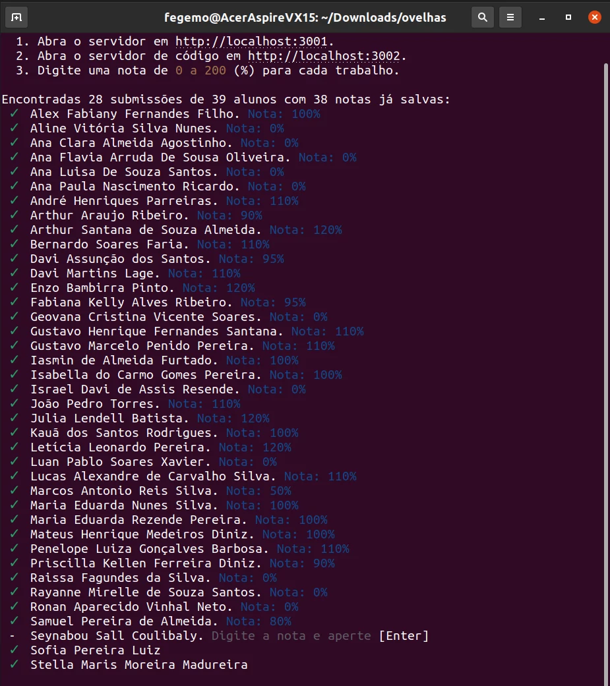

# Ajudator

Um conjunto de scripts para ajudar a corrigir trabalhos de Web entregues pelo Moodle.




## Instalação e uso

1) [Apenas 1ª vez] No terminal:

```bash
git clone git@github.com:fegemo/ajudator
cd ajudator
npm install
npm link
```

Isso possibilita executar o comando `ajudator` globalmente no computador.

2) [A cada atividade] No Moodle, baixar um arquivo compactado com todas as submissões.


3) [A cada atividade] Descompactar esse arquivo e, dentro da pasta criada, criar um arquivo `alunos.json`
[1 vez por ano letivo] nessa pasta contendo um vetor de strings dos nomes dos alunos retirados do SIGAA.
Depois, executar:

```bash
ajudator
```


4) [A cada atividade] Acessar a URL para corrigir o trabalho do primeiro aluno, fazendo 
marcações e comentários. Após verificar/comentar cada arquivo do aluno, imprimir um
PDF referente a esse arquivo e salvar na pasta da atividade do aluno. Ao final da
correção do primeiro trabalho, digitar a nota de 0 a 200 no terminal.
Repetir até terminar todos os alunos.


5) [A cada atividade] Ao final, terá sido gerado o `notas.json`. No Moodle, na página de 
correção rápida de atividades, copiar/colar o `snippets/preenche-notas-no-moodle.js`
para a aba Snippets de Sources da ferramenta do desenvolvedor, substituir o vetor
`tarefas` pelo conteúdo de `notas.json` e executar.


6) [A cada atividade] Além do `notas.json` (e `notas.csv`, se necessário para planilhas),
percorrer as pastas de cada aluno excluindo todos os arquivos exceto pelos arquivos
PDF gerados. No final, selecionar todas as pastas de alunos e gerar um arquivo `.zip`.


7) [A cada atividade] Na mesma página de correção da atividade no Moodle, no topo,
escolher a ação  "Fazer upload de múltiplos arquivos..." e submeter o arquivo `.zip` gerado.

